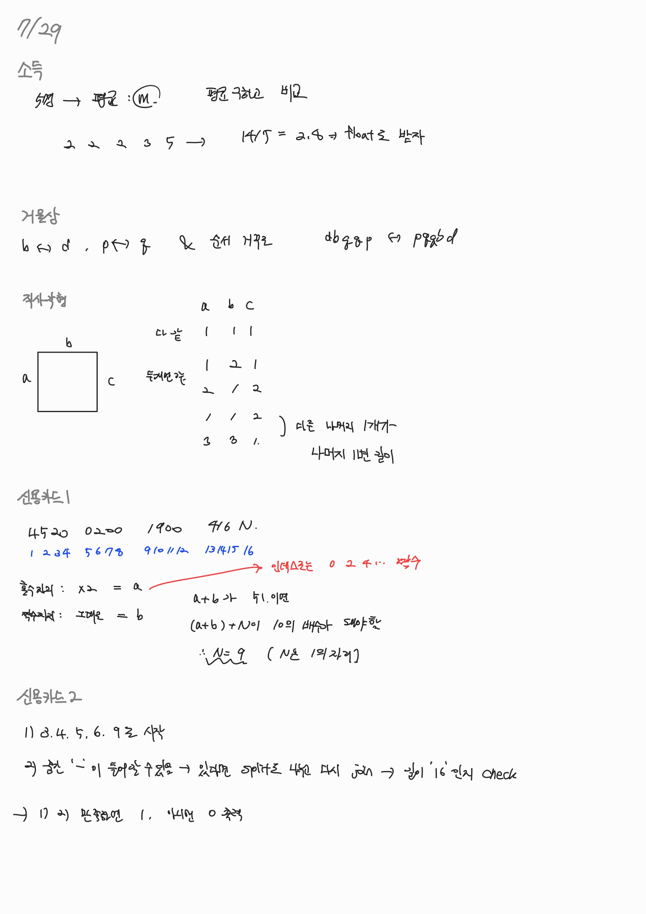
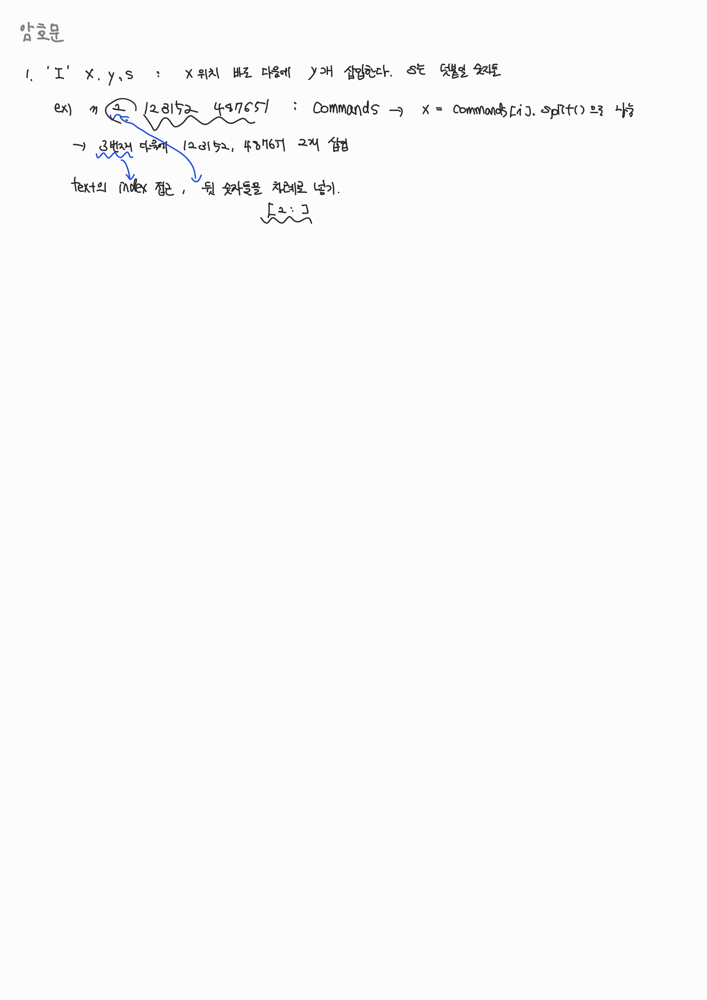

## 후기

 처음으로 실전과 비슷하게 (난이도는 당연 아니지만) 모의고사를 해봤는데,
구글링이나 찾아보는 것도 안되고 오직 내가 아는 지식과 빈 연습장만 가능하다해서
살짝 긴장도 했는데 생각보다 전체적인 난이도는 처음이라 그런지 이번주 실습시간에 풀었던문제들 보다는 쉬웠다고 느꼈다.

 다만 환경의 제약이 생기니 그 부분에서 어려움이 생겼다. 문제를 어떻게 풀어야할지는 아는데, 문법적인 부분이나 메서드를 어떻게 쓰더라 하는 궁금증이 생기면 평소였으면 바로 구글링을했을건데 그런 부분들이 불가능해지니 계속 고민을 하고 하나하나 프린트하고 에러가 뜨면 내가 아는 코드 문법 방식으로 했다.

 이렇게 바로 안 찾아보고 고민을 해보니 또 좋았다. 특히 0번 문제에서 정렬을 하려할 때
어떻게 정렬하는지 문법이 생각이 바로 안 났는데, 고민을 좀 하니까 며칠 전 조원분이 썼던
람다함수가 생각이 났다. 또 내림차순은 reverse가 아니고 x : -x[1] 이런식으로 쓰는 것도
생각이 났었다.

 역시 마지막 문제가 제일 난이도가 높았다. 다 풀고 나니까 또 엄청 어려운 문제는 아니였구나 싶은데, 문제를 잘 읽고 내가 손으로 써 가면서 '처음에 이거랑 이거를 input으로 받고 어떻게 저장해야할까?', '저장한 댜음에는 원하는 순서에 어떻게 접근을 할까' ,'왜 내가 원하는 형태로 출력이 안 되지?' 등을 계속 생각했다. 잘 모르겠으면 하나씩 데이터를 받고, 또
그 데이터를 다른 타입으로 변환시키거나 슬라이싱 하거나 할때는 항상 print를 통해 내가 어디까지 왔는지 생각을 하고 진행하니 그나마 덜 헷갈렸다고 생각한다.

 아직도 실력이 부족하지만 처음 파이썬 배울때에 비하면 그래도 코드 쓰고 문제를 푸는데 좀 더 익숙해졌다고 생각한다. 알고리즘 파트는 앞으로 더 어렵고 복잡할 것이지만 그래도 꾸준하게 끈기있게 공부해가야겠다.

